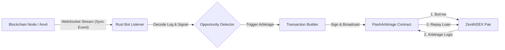

# Zenith-Arb-Bot 🦀


**Zenith-Arb-Bot** is a high-performance, event-driven MEV (Maximum Extractable Value) bot written in **Rust**. It is designed to monitor decentralized exchanges (DEX) for liquidity events and execute atomic **Flash Loan Arbitrage** strategies.

Built with the next-generation Ethereum interaction library **Alloy** (by Paradigm), this bot demonstrates modern Web3 development practices, focusing on low latency, type safety, and memory efficiency.

---

## ⚡ Key Features

* **🚀 Rust & Alloy Stack:** Leverages Rust's zero-cost abstractions and the new `alloy-rs` ecosystem for maximum performance.
* **🎧 Event-Driven Architecture:** Uses **WebSockets (`ws://`)** to subscribe to blockchain logs (`Sync` events) in real-time, eliminating the latency of HTTP polling.
* **⚡ Atomic Flash Loans:** Integrates with a custom Solidity contract to borrow assets, execute trades, and repay loans in a single transaction. Zero risk of capital loss (transaction reverts if unprofitable).
* **🔐 Local Simulation Ready:** Fully compatible with **Foundry/Anvil** local testnets for safe strategy development and testing.
* **🔄 Async Runtime:** Built on top of **Tokio** to handle concurrent event streams and non-blocking transaction broadcasting.

## 🏗 Architecture



## 🛠 Tech Stack

* **Language:** Rust (Edition 2021)
* **Ethereum Library:** Alloy (The successor to ethers-rs)
* **Async Runtime:** Tokio
* **Error Handling:** Eyre
* **Target Network:** EVM Compatible (Ethereum, L2s, Local Anvil)

## 🚀 Getting Started

* **Prerequisites**
* Rust Toolchain (Cargo & Rustc)
* Foundry (For running the local blockchain node)

Installation
**1. Clone the repository**
```bash
git clone [https://github.com/yiguangchao/Zenith-Arb-Bot](https://github.com/yiguangchao/Zenith-Arb-Bot)
cd zenith_bot
```
**2. Start Local Node (Anvil) In a separate terminal, start the local blockchain:**
```bash
anvil
```
**3. Deploy Contracts** (Ensure you have the ZenithDEX contracts deployed and obtain the Pair and FlashArbitrage addresses).
**4. Configure Addresses Update** src/main.rs with your deployed contract addresses:
```bash
let pair_address = address!("YOUR_PAIR_ADDRESS");
let flash_arb_address = address!("YOUR_FLASH_CONTRACT_ADDRESS");
```
**5. Run the Bot**
```bash
cargo run
```

## 📸 Demo Output

When a liquidity event is detected on-chain, the bot reacts instantly:
```bash
✅ Arbitrage Bot Connected!
🎯 Waiting for signals...

🚨 Signal Detected! Executing Flash Loan...
🚀 Transaction Broadcasted! Hash: 0x17205f89a15ba77242c74cc79ee4ea50737cd7af08d4d1cb761a2751ee45a291
```

## ⚠️ Disclaimer
This project is for educational and research purposes only. Flash loan arbitrage on Mainnet is highly competitive (PVP) and requires advanced strategies (Mempool scanning, Bundles) to be profitable.

## 👨‍💻 Author
* **Guangchao Yi** *Senior Blockchain Engineer & Rust Enthusiast*
